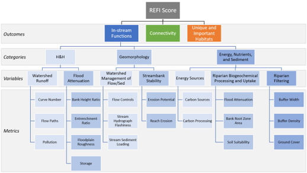

--- 
title: "Buffer Relative Assessment Tool (BRAT)"
author: "Rosamar Ayala Torres and S. Kyle McKay"
date: "September 2025"
description: The U.S. Army Engineer Research and Development Center (ERDC) has developed a simple model for assessing riparian ecosystems based on rapid desktop methods primarily related to buffer width. This report documents the development of this model and its use.
github-repo: skmckay/BRAT
runtime: shiny
---

# Front Matter {-}

<span style="color: red;">DRAFT REPORT UNDERGOING REVIEW AND USACE CERTIFICATION</span>

The final, reviewed report can be downloaded here as an ERDC Technical Note. (<span style="color: red;">ADD LINK LATER</span>)

Points of Contact:

Rosamar Ayala Torres  
rosamar.ayala-torres at erdc.dren.mil  
Environmental Laboratory  
Vicksburg, MS 39180

S. Kyle McKay, Ph.D., P.E.  
kyle.mckay at usace.army.mil  
Phone: 970-980-9747  
Environmental Laboratory  
New York, NY 10278


```{r, echo=FALSE, include=FALSE}
#Markdown options
knitr::opts_chunk$set(echo=FALSE, warning=FALSE, message = FALSE) 

#Clear local memory
rm(list=ls(all=TRUE))

##########
#Load all necessary R packages
library(ecorest)
library(shiny)
```


# ABSTRACT

Insert later.


# INTRODUCTION

Insert later.


# CONCEPTUALIZATION

Insert description of the conceptual view of the system related to instream outcomes, habitat outcomes, and connectivity.


```{r, echo=FALSE, fig.cap="Figure 1. Conceptual model of instream stuff."}

```


# QUANTIFICATION

Provide a brief background on the meta-analysis and its role in this project.  

Describe the overarching three functional outcomes and present an equation for combining these functions.

$REFI_{0} = \frac{instream + habitat + connectivity}{3}$


## Instream Effects of Riparian Zones

Insert general background.

Show suitability curves.

Paragraph justifying suitability curve 1. Present equation of the suitability curve.

$SI_{ins} = 44.706+8.194*ln(w_{avg})$

## Riparian Zones as Unique and Important Habitats

Insert general background.

Show suitability curves.

Paragraph justifying suitability curve 1. Present equation of the suitability curve.

$SI_{hab} = 0.667+20*ln(w_{avg})$


## Riparian Zones as Corridors

Insert general background.

Show suitability curves.

Paragraph justifying suitability curve 1. Present equation of the suitability curve.

$SI_{cor} = 1.0+10.0*ln(w_{min})$

Paragraph justifying suitability curve 2. Present equation of the suitability curve.

$y = mx+b$


## Model Code

Insert general background on R and functions. Compile REFI0 as a function using ecorest. 

```{r, echo=TRUE}
#Specify function for the simple riparian model (SRM)
  #width.avg = average riparian buffer width for a reach defined in meters
  #width.min = minimum riparian buffer width for a reach defined in meters

SRM <- function(width.avg, width.min){
  #Compute suitability relative to instream outcomes based on contaminant removal mean regression from Ayala et al. (2024)
  SI.ins <- 44.706 + 8.194*log(width.avg)
  SI.ins <- SI.ins / 100

  #Compute suitability relative to habitat outcomes based on biodiversity mean regression from Ayala et al. (2024)
  SI.hab <- 0.667 + 0.044*log(width.avg)
  #SI.hab <- SI.hab / 100
  SI.hab <- SI.hab 

  #Compute suitability relative to corridor outcomes based on TBD
  SI.cor <- 1.0 + 10.0*log(width.min)
  SI.cor <- SI.cor / 100
  
  #Compute overal suitability metric as the average of the three suitability indices
  SI.total <- mean(SI.ins, SI.hab, SI.cor)
  
  #Send output as data frame
  SRM.out <- data.frame(SI.ins, SI.hab, SI.cor, SI.total)
  colnames(SRM.out) <- c("instream", "habitat", "corridor", "total")
  row.names(SRM.out) <- NULL
  SRM.out
}

#Test function
SRM(50,100)
```

Play around with plotting the suitability curves

```{r}
#Specify a set of input ranges to display suitability curves
width.test <- seq(0,100,1)

#Empty vectors to store results
SIplot.ins <- c()
SIplot.hab <- c()
SIplot.cor <- c()
for(i in 1:length(width.test)){
  SIplot.ins[i] <- SRM(width.test[i],1)$instream
  SIplot.hab[i] <- SRM(width.test[i],1)$habitat
  SIplot.cor[i] <- SRM(1,width.test[i])$corridor
}

##########
#Create multi-panel plot to display suitability curves
par(mgp=c(2.5,0.5,0), mar=c(6, 4, 1, 1), #these control margins
    mfrow=c(1,3), #Changes the number of panels (number of rows, number of columns) 
    cex=1.0) #controls text size

#Plot INSTREAM suitability
plot(width.test, SIplot.ins, type="l", xlim=c(0,100), ylim=c(0,1), lwd=3,
     xlab="Average Buffer Width (m)", ylab="Instream Suitability (Removal Efficiency)")

#Plot HABITAT suitability
plot(width.test, SIplot.hab, type="l", xlim=c(0,100), ylim=c(0,1), lwd=3,
     xlab="Average Buffer Width (m)", ylab="Habitat Suitability (Species Richness)")

#Plot CORRIDOR suitability 
plot(width.test, SIplot.cor, type="l", xlim=c(0,100), ylim=c(0,1), lwd=3,
     xlab="Minimum Buffer Width (m)", ylab="Corridor Suitability (Constraint)")

```

```{r}
cbind(width.test, SIplot.ins, SIplot.hab)
```


```{r}
0.667 + 0.044*log(8)

0.471 + 0.057*log(8)
```

Old code that might be useful.


```{r}
#Create data frame for suitability curves
#riparian0 <- data.frame(matrix(NA, nrow=5, ncol=8))
#colnames(riparian0) <- c("Ins.Buffer.Width.Avg.m", "Index.Instream", "Bio.Buffer.Width.Avg.m", "Index.Biodiversity", "Buffer.Width.Min.m", "Index.Connectivity1", "Edge.Density", "Index.Connectivity2")

#Specify suitability curves
#riparian0$Ins.Buffer.Width.Avg.m <- c(0, 50, 100, 100, NA)
#riparian0$Index.Instream <- c(0.0, 0.5, 0.9, 1.0, NA)
#riparian0$Bio.Buffer.Width.Avg.m <- c(0, 10, 50, 500, 1000)
#riparian0$Index.Biodiversity <- c(0.0, 0.2, 0.4, 0.9, 1.0)
#riparian0$Buffer.Width.Min.m <- c(0, 100, 1000, NA, NA)
#riparian0$Index.Connectivity1 <- c(0.0, 1.0, 1.0, NA, NA)
#riparian0$Edge.Density <- c(0.00, 0.026, 0.046, 0.1, NA)
#riparian0$Index.Connectivity2 <- c(1.0, 1.0, 0.0, 0.0, NA)

#Create function here using ecorest.
#library(ecorest)
#input.riparian <- c(75, 75, 25, 0.03)
#SIcalc(riparian0, input.riparian)

```


Show the model's inclusion in Colton and Sam's online calculator?

```{r}
#A screen capture of the online model.
#{r, echo=FALSE, fig.cap="Figure 1. Engineering economics cash flow diagrams."}
#knitr::include_graphics("ZZ_EngrEconCashFlow.png")
```


## Shiny App

Insert embdded shiny app.

```{r echo=FALSE}
# Define UI
ui <- fluidPage(
  titlePanel("Simple Equation Calculator"),
  
  sidebarLayout(
    sidebarPanel(
      numericInput("num1", "Input 1:", value = 1),
      numericInput("num2", "Input 2:", value = 2),
      numericInput("num3", "Input 3:", value = 3),
      numericInput("num4", "Input 4:", value = 4)
    ),
    
    mainPanel(
      h3("Calculated Output"),
      verbatimTextOutput("result"),
      plotOutput("barPlot")
    )
  )
)

# Define server logic
server <- function(input, output) {
  
  # Reactive expression to calculate result
  result <- reactive({
    # Simple equation: weighted sum
    0.5 * input$num1 + 1.5 * input$num2 + input$num3 - 0.75 * input$num4
  })
  
  # Output the result
  output$result <- renderText({
    paste("Result:", round(result(), 2))
  })
  
  # Output the plot
  output$barPlot <- renderPlot({
    values <- c(input$num1, input$num2, input$num3, input$num4)
    weights <- c(0.5, 1.5, 1, -0.75)
    contributions <- values * weights
    
    barplot(contributions,
            names.arg = c("Input 1", "Input 2", "Input 3", "Input 4"),
            col = "steelblue",
            main = "Contribution of Each Input",
            ylab = "Weighted Value")
  })
}

# Run the application 
shinyApp(ui = ui, server = server, options = list(height = 500))
```


# MODEL EVALUATION

Describe the basic battery of model evaluation relative to system quality, technical quality, and usability.


```{r}
#Present model testing with different input vectors

#Create data frame to store model testing
test.matrix <- data.frame(matrix(NA, nrow=0, ncol=5))
colnames(test.matrix) <- c("Component", "Avg Width (m)", "Min Width (m)", "Expected", "SRM Output")

#Specify test cases
test.matrix[1,1:4] <- c("SIins", 0, 0, 0)
test.matrix[2,1:4] <- c("SIins", 1000, 0, 1)
test.matrix[3,1:4] <- c("SIhab", 0,1000,1)
test.matrix[4,1:4] <- c("SIins", 0, 0, 0)
test.matrix[5,1:4] <- c("SIins", 1000, 0, 1)
test.matrix[6,1:4] <- c("SIhab", 0,1000,1)
test.matrix[7,1:4] <- c("SIins", 0, 0, 0)
test.matrix[8,1:4] <- c("SIins", 1000, 0, 1)
test.matrix[9,1:4] <- c("SIhab", 0,1000,1)

#Compute SRM output
#test.matrix[1,5] <- SRM(test.matrix[1,1], test.matrix[1,2])$instream

#Send table
test.matrix
```


# MODEL APPLICATION

Present a simple example of model application in a riparian zone. Maybe Beargrass Creek or Utoy Creek?


# SUMMARY

Insert one paragraph summary.


# ACKNOWLEDGEMENTS {-}

Model development was funded by the U.S. Army Corps of Engineers' Ecosystem Management and Restoration Research Program ([EMRRP](https://emrrp.el.erdc.dren.mil/)). The authors are grateful to Garrett Menichino, Sam Wiest, and Colton Shaw for their broader contributions to an EMRRP study of riparian ecological modeling and their roles in assisting with the web application. This model was reviewed by Kip Runyon, Mick Porter, Aubrey Harris, and others. Opinions expressed here are those of the authors and not necessarily those of the agencies they represent.


# References {-}

Ayala Torres R., Dietterich L., Wiest S., and McKay S.K.  2024. Meta-analysis of riparian zone width effects on contaminant removal and biodiversity. Submitted to Ecological Applications. 

Fischer, R. A., & Fischenich, J. C. (2000). Complexity Value as a Planning Tool Design Recommendations for Riparian Corridors and Vegetated Buffer Strips.

Gurevitch, J., Koricheva, J., Nakagawa, S., & Stewart, G. (2018). Meta-analysis and the science of research synthesis. Nature, 555(7695), 175–182. https://doi.org/10.1038/nature25753

Lind, L., Hasselquist, E. M., & Laudon, H. (2019). Towards ecologically functional riparian zones: A meta-analysis to develop guidelines for protecting ecosystem functions and biodiversity in agricultural landscapes. In Journal of Environmental Management (Vol. 249). Academic Press. https://doi.org/10.1016/j.jenvman.2019.109391

Wenger, S. (1999). A review of the scientific literature on riparian buffer width , extent and vegetation. In Institute of Ecology, University of Georgia. https://www.soils.org/publications/sssaj/abstracts/73/6/2078

Zhang, X., Liu, X., Zhang, M., Dahlgren, R. A., & Eitzel, M. (2010). A Review of Vegetated Buffers and a Meta‐analysis of Their Mitigation Efficacy in Reducing Nonpoint Source Pollution. Journal of Environmental Quality, 39(1), 76–84. https://doi.org/10.2134/jeq2008.0496

