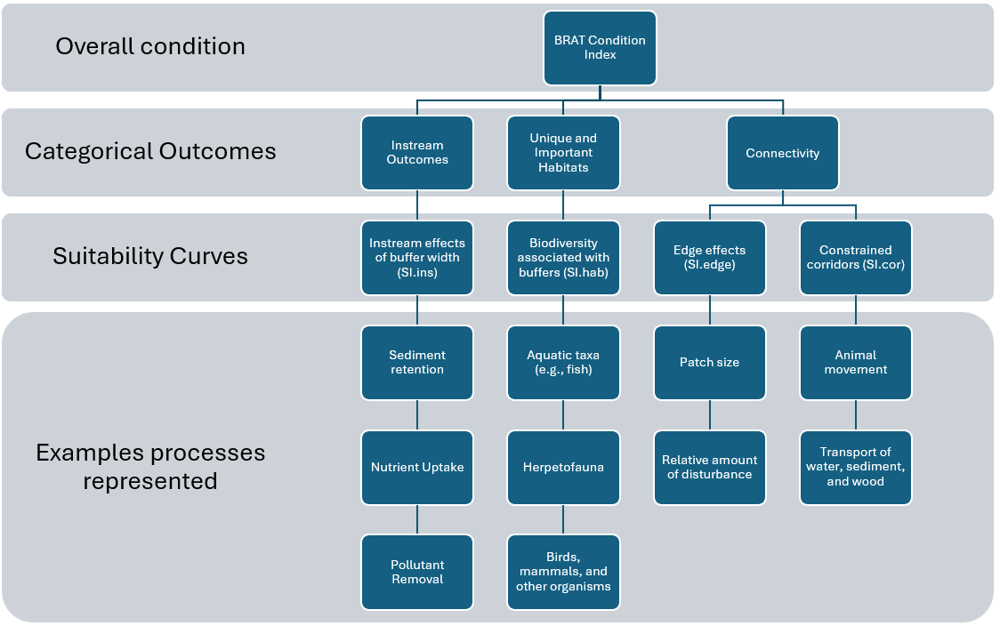

--- 
title: "Buffer Relative Assessment Tool (BRAT)"
author: "S. Kyle McKay and Rosamar Ayala Torres"
date: "December 2025"
description: This tool provides a simple model for assessing riparian ecosystems based on rapid desktop methods primarily related to buffer width. This report documents the development and use of this model.
github-repo: skmckay/BRAT
runtime: shiny
---

Points of Contact:

S. Kyle McKay, Ph.D., P.E., New York, NY, [skmckay@gmail.com](skmckay@gmail.com)

Rosamar Ayala Torres, Environmental Laboratory, U.S. Army Engineer Research and Development Center, Vicksburg, MS, [rosamar.ayala-torres@erdc.dren.mil](rosamar.ayala-torres@erdc.dren.mil)


```{r, echo=FALSE, include=FALSE}
#Markdown options
knitr::opts_chunk$set(echo=FALSE, warning=FALSE, message = FALSE) 

#Clear local memory
rm(list=ls(all=TRUE))

##########
#Load all necessary R packages
library(ecorest)
library(shiny)
#library(shinylive)
```


# **Abstract**

Riparian zones are transitional ecosystems between aquatic freshwaters (e.g., streams, lakes, and wetlands) and terrestrial, upland areas. These habitats provide critical ecological functions and ecosystems services and are often the focus of restoration and management. This report presents a simple quantitative tool for assessing riparian zone condition based on rapidly applicable desktop analyses. The Buffer Relative Assessment Tool (BRAT) seeks to inform preliminary stream restoration planning when comparing the relative merits of multiple restoration sites (e.g., Site-A vs. Site-B) or divergent alternatives (e.g., large-scale levee setback vs. riparian planting of existing riparian areas). 


# **Introduction**

Riparian zones are transitional ecosystems between aquatic freshwaters (e.g., streams, lakes, and wetlands) and terrestrial, upland areas. These ecosystems provide an enormous array of physical and ecological functions such as attenuation of floods, filtration of pollution and accompanying water quality improvement, regulation of stream temperatures, and provision of habitat for aquatic and terrestrial organisms. Accordingly, riparian zones are a major focus of ecosystem management (Johnson et al. 2018) and environmental regulation (Wenger et al. 1999). 

Riparian zones have been extensively studied through a variety of disciplinary and interdisciplinary lenses (e.g., taxa-specific habitat investigations and management-focused guidelines, respectively). Many tools have been developed to inform riparian management ranging from mechanistic vegetative growth models to habitat suitability indices to multi-metric scoring systems (Wiest et al. 2023, Dickard et al 2015). As a simple proxy, riparian zone width has provided a useful first order metric for estimating functional outcomes, and qualitative guidance has recommended specific width thresholds associated with specific ecological outcomes (Wenger et al. 1999, Fischer and Fischenich 2000a, Ellis 2008, Lind et al. 2019).

This report documents development of a simple quantitative tool for assessing riparian zone quality based on rapidly applicable desktop analyses, the Buffer Relative Assessment Tool (BRAT). The model seeks to inform preliminary stream restoration planning when comparing the relative merits of multiple restoration sites (e.g., Site-A vs. Site-B) or divergent alternatives (e.g., large-scale levee setback vs. riparian planting of existing riparian areas). This report describes the goals of the model, the theory supporting model structure, numerical code executing the model, and model testing and evaluation. 


# **Model Development Process**

The BRAT was developed as one of three riparian modeling tools spanning a wide range of uses and levels of effort (Table 1). The BRAT uses simple equations to estimate riparian quality based on desktop analysis of data easily accessible from aerial photography, commonly available geospatial data layers, or professional judgment. The Riparian Ecological Functions Index (REFI, Wiest et al. 2026) provides a rapid field assessment technique based on semi-quantitative scoring of multiple riparian functions. The Web Application for Riparian Models (WARM, Shaw et al. 2026) compiles regionally tailored models for quantifying ecological outcomes, which typically require more detailed monitoring. Collectively, these tools provide a continuum of levels of effort, which can inform ecosystem restoration decisions ranging from preliminary project planning to feasibility-level design to long-term monitoring. 

```{r echo=FALSE}
#Create empty table
Table01 <- as.data.frame(matrix(NA, nrow = 5, ncol = 4))
colnames(Table01) <- c("Scoping Issue", "Buffer Relative Assessment Tool (BRAT)", "Riparian Ecological Functions Index (REFI)", "Web Application for Riparian Models (WARM)")

#Specify rows of the table
Table01[1,] <- c("Documentation", "Ayala Torres and McKay (this report), Ayala Torres et al. (2025)", "Wiest et al. (2026)", "Shaw and Wiest (2023), Shaw et al. (2026)")
Table01[2,] <- c("Primary purpose", "Screen divergent actions", "Preliminary assessment of ecological benefits of restoration.", "Quantification of regionally specific riparian outcomes.")
Table01[3,] <- c("Level of effort per site", "Minutes-hours", "Hours-days", "Days to weeks")  
Table01[4,] <- c("Spatial Extent", "Global", "National", "Regional")
Table01[5,] <- c("Output Type", "0 to 1 index based on instream functions, habitat outcomes, and connectivity", "0 to 1 index based on instream functions, habitat outcomes, and connectivity", "0 to 1 index based on regionally specified model structures")

#Send output table rows into a single matrix
rownames(Table01) <- NULL
knitr::kable(Table01, caption="Table 1. A continuum of riparian modeling tools developed to inform ecosystem restoration decisions.", align="c") 
```

The BRAT was developed primarily from the extensive body of peer-reviewed riparian studies and scientific literature. In particular, large parts of the model were derived from a quantitative meta-analysis of riparian buffer performance (Ayala Torres et al. 2025), which were then augmented by other scientific studies (Fischer and Fischenich 2000b, Rhode et al. 2005, Ellis 2008). Although based in literature review, a common ecological modeling process of conceptualization, quantification, evaluation, application, and communication (Grant and Swannack 2008) guided development of BRAT and serves as the overarching structure for this report. 


# **Conceptualization**

In general, the BRAT seeks to capture the general condition of riverine riparian areas. BRAT is applied at the reach-scale and produces a 0 to 1 index of riparian quality, where 0 is no ecological value and 1 is optimal condition. Index-based models of this type are typically combined with a measure of habitat quantity (i.e., area in acres) to produce an overarching metric of so-called "habitat units". While many restoration analyses consider changes in condition through time, BRAT does not include temporal processes and represents a single snapshot in condition based solely on desktop inputs. The spatial scale of BRAT is the channel reach, as defined by the user. However, reaches should be defined similarly across sites to create a consistent frame of comparison, and users are cautioned against using reaches less than 500m to avoid false precision associated with BRAT's high-level estimation goals. 

Ecological functions of riparian areas have been assessed relative to a diverse set of outcomes and functions (Dickard et al 2015, Johnson et al. 2018, Wiest et al. 2023). In the REFI framework, Wiest et al. (2026) assess riparian functional outcomes based on three primary categories: (1) effects of riparian function on instream processes such as water quality and geomorphology, (2) the importance of areas as habitat for aquatic and terrestrial organisms, and (3) the role of riparian zones as corridors for animal movement. BRAT adopts this general framework for assessing riparian functions as the overarching structure of the model (Figure 1).

```{r, echo=FALSE, fig.cap="Figure 1. Conceptual model of BRAT."}

```

Notably, the BRAT is not intended for application in all environments and was developed primarily for wadeable streams. Riparian buffers exist in many other contexts that are beyond the scope of this tool (e.g., tidal influence, lake or wetland systems, large rivers), and the model should not be applied in these systems. Furthermore, the model should be constrained to preliminary planning efforts or high-level findings, and the BRAT should not be used to inform final design.


# **Quantification**

Model quantification involves formalizing a conceptual model into a set of mathematical relationships, model parameters, and numerical algorithms (Grant and Swannack 2008). As mentioned, the BRAT quantifies three main ecological functions of riparian zones (instream processes, habitat provision, and corridor functions), which align with the REFI model structure (Wiest et al. 2026). Each of the three modules is assessed independently as a 0-to-1 index of ecosystem condition. Overall riparian condition is computed as the average of the quality scores for each module, which assumes that each function can occur without the others and mirrors the structure of REFI. Each module is viewed as an equally important contribution to overall stream function, and no weighting of outcomes is applied. Therefore, ecosystem quality is calculated as follows:

$BRAT = \frac{I_{ins} + I_{hab} + I_{con}}{3}$

Where $BRAT$ is an overarching index of riparian condition scaled from 0 to 1 and $I_{x}$ are indices of riparian condition relative to instream, habitat, and connectivity functions.

The BRAT compiles existing metrics of riparian condition presented in scientific literature for each of these three functional categories. In particular, the instream and habitat functions are derived from equations presented in Ayala Torres et al. (2025), who conducted a global meta-analysis of riparian buffer performance relative to pollutant retention and biodiversity outcomes. The corridor functions are derived from studies of riparian zone fragmentation (Rhode et al. 2005) and widths limiting moving for multiple taxa (Ellis 2008). The following sections briefly describe each of these functions, the underlying studies supporting them, and the assumed functional form of these indices within BRAT. This section also describes model execution in the R statistical software language (R Core Team 2022) in both a readily adaptable functional form as well as an interactive web application.


```{r echo=FALSE, fig.height = 6, fig.width = 6, fig.cap="Figure 2. BRAT suitability index curves."}
#Specify a set of input ranges to display suitability curves
width.test <- c(0.1,seq(1,1000,1))

#Empty list to store suitability curves
BRAT.SI.plot <- list()

#Specify instream curve
BRAT.SI.plot[[1]] <- matrix(c(0,3,30,100, 0.0, 0.55, 0.75, 1.0), nrow=4, ncol=2)

#Specify habitats curve
BRAT.SI.plot[[2]] <- matrix(c(0,5,100,500, 0.0, 0.75, 0.85, 1.0), nrow=4, ncol=2)

#Specify edge density curve from Rhode et al. (2005) in units of per m
BRAT.SI.plot[[3]] <- matrix(c(0,0.085,0.15,0.65, 1.0, 1.0, 1.0, 0.1, 0.1, 0.1), nrow=5, ncol=2)

#Specify minimum width curve in meters
BRAT.SI.plot[[4]] <- matrix(c(0, 10, 50, 300, 0.0, 0.5, 1.0, 1.0), nrow=4, ncol=2)

#Specify Ayala-Torres et al. (2025) pollutant regressions for 50th
BRAT.SI.plot[[5]] <- cbind(width.test, (44.706 + 8.194*log(width.test))/100)

#Specify Ayala-Torres et al. (2025) pollutant regressions for 10th
BRAT.SI.plot[[6]] <- cbind(width.test, (-14.679 + 16.530*log(width.test))/100)

#Specify Ayala-Torres et al. (2025) pollutant regressions for 90th
BRAT.SI.plot[[7]] <- cbind(width.test, (89.666 + 2.524*log(width.test))/100)

#Specify Ayala-Torres et al. (2025) biodiversity regressions for 50th
BRAT.SI.plot[[8]] <- cbind(width.test, (67.049 + 3.850*log(width.test))/100)

#Specify Ayala-Torres et al. (2025) biodiversity regressions for 10th
BRAT.SI.plot[[9]] <- cbind(width.test, (44.543 + 2.822*log(width.test))/100)

#Specify Ayala-Torres et al. (2025) biodiversity regressions for 90th
BRAT.SI.plot[[10]] <- cbind(width.test, (99.810 + 0.040*log(width.test))/100)

#Name the list items
names(BRAT.SI.plot) <- c("Plot.ins", "Plot.hab", "Plot.edge", "Plot.min", 
                         "Ayala.pol.50", "Ayala.pol.10", "Ayala.pol.90",
                         "Ayala.bio.50", "Ayala.bio.10", "Ayal.bio.90")

##########
#Create multi-panel plot to display suitability curves
par(mgp=c(2.5,0.5,0), mar=c(6, 4, 1, 1), #these control margins
    mfrow=c(2,2), #Changes the number of panels (number of rows, number of columns) 
    cex=0.9) #controls text size

#Plot INSTREAM suitability
plot(c(0,100), c(0,1), type="n", xlim=c(0,100), ylim=c(0,1),
     xlab="Average Buffer Width (m)", ylab="Instream Suitability", main="SI.ins")
lines(BRAT.SI.plot[[5]][,1], BRAT.SI.plot[[5]][,2], lty=3, lwd=0.5) #Ayala regression 50th
lines(BRAT.SI.plot[[6]][,1], BRAT.SI.plot[[6]][,2], lty=3, lwd=0.5, col="red") #Ayala regression 10th
lines(BRAT.SI.plot[[7]][,1], BRAT.SI.plot[[7]][,2], lty=3, lwd=0.5, col="red") #Ayala regression 90th
lines(BRAT.SI.plot[[1]][,1], BRAT.SI.plot[[1]][,2], lwd=1) #Interpolation
points(BRAT.SI.plot[[1]][,1], BRAT.SI.plot[[1]][,2], pch=19, lwd=2) #Breakpoints
legend("bottomright", legend=c("BRAT","Ayala-Torres (mean)", "Ayala-Torres(10th/90th)"), lty=c(1,3,3), col=c("black", "black", "red"), cex=0.5)

#Plot HABITAT suitability
plot(c(0,500), c(0,1), type="n", xlim=c(0,500), ylim=c(0,1),
     xlab="Average Buffer Width (m)", ylab="Habitat Suitability", main="(B) SI.hab")
lines(BRAT.SI.plot[[8]][,1], BRAT.SI.plot[[8]][,2], lty=3, lwd=0.5) #Ayala regression 50th
lines(BRAT.SI.plot[[9]][,1], BRAT.SI.plot[[9]][,2], lty=3, lwd=0.5, col="red") #Ayala regression 10th
lines(BRAT.SI.plot[[10]][,1], BRAT.SI.plot[[10]][,2], lty=3, lwd=0.5, col="red") #Ayala regression 90th
lines(BRAT.SI.plot[[2]][,1], BRAT.SI.plot[[2]][,2], lwd=1) #Interpolation
points(BRAT.SI.plot[[2]][,1], BRAT.SI.plot[[2]][,2], pch=19, lwd=2) #Breakpoints
legend("bottomright", legend=c("BRAT", "Ayala-Torres (mean)", "Ayala-Torres(10th/90th)"), lty=c(1,3,3), col=c("black", "black", "red"), cex=0.5)

#Plot EDGE suitability
plot(c(0,100), c(0,1), type="n", xlim=c(0,1), ylim=c(0,1),
     xlab="Edge Density (m/m2)", ylab="Connectivity Suitability (edge)", main="(C) SI.edge")
lines(BRAT.SI.plot[[3]][,1], BRAT.SI.plot[[3]][,2], lwd=1) #Interpolation
points(BRAT.SI.plot[[3]][,1], BRAT.SI.plot[[3]][,2], pch=19, lwd=2) #Breakpoints

#Plot MINIMUM suitability
plot(c(0,100), c(0,1), type="n", xlim=c(0,100), ylim=c(0,1),
     xlab="Minimum Buffer Width (m)", ylab="Connectivity Suitability (min)", main="(D) SI.min")
lines(BRAT.SI.plot[[4]][,1], BRAT.SI.plot[[4]][,2], lwd=1) #Interpolation
points(BRAT.SI.plot[[4]][,1], BRAT.SI.plot[[4]][,2], pch=19, lwd=2) #Breakpoints
```

## Instream Effects of Riparian Zones

Riparian buffers are often justified based on their well-described benefits to instream processes such as water quality improvement, streambank stabilization, thermal and light regulation, and flood attenuation. Hundreds of studies have been conducted examining the mechanisms by which riparian properties like slope, width, soil properties, and vegetation type influence these functions (Wenger 1999, Fischer and Fischenich 2000). The number of individual studies has grown to sufficient size to examine trends across these studies using techniques like meta-analysis (Zhang et al. 2010, Lind et al. 2019). 

Ayala-Torres et al. (2025) conducted a global meta-analysis of riparian buffer performance relative to pollutant retention processes as well as biodiversity outcomes. Over 350 studies met the criteria for inclusion in their analysis, but only 34 pollutant retention studies provided sufficient statistical summary data for use in a quantitative meta-regression. These studies addressed retention of nitrogen (n=34), phosphrous (n=24), and sediment (n=19) and included a width range of slope and vegetation conditions. Across these studies, riparian width was a strongly significant metric of pollutant uptake (p<0.0001). Meta-regression equations were provided by the authors based on expected value (i.e., regression to the mean) as well as prediction intervals (i.e., quantile regression).

BRAT uses the meta-regression of Ayala-Torres et al. (2025) as the primary basis for assessing effects of riparian buffer width on instream processes. Their logarithmic regressions equations were reinterpreted in the common format of habitat suitability curves with break points and linear interpolation by using a standardized ecological modeling tool (Carrillo et al. 2022). These linear regressions allowed for the models to be corrected at extreme boundaries (e.g., forcing suitability to 0 when width was 0) and allowed for the models to be presented relative to common thresholds used by riparian managers (e.g., 3, 30, and 100m). While the original analysis focused on water quality benefits (Ayala-Torres et al. 2025), BRAT assumes that these processes generally require greater width than other instream outcomes like streambank stabilization, an assumption upheld in other riparian syntheses (Fischer and Fischenich 2000).

Figure 2A shows these suitability curves graphically relative to the original logarithmic models of Ayala-Torres et al. (2025), and the instream suitability index may be calculated as: 

$$I_{ins} = \begin{pmatrix} 0.00+0.183*w_{avg} & w_{avg}<3\\
0.53+0.0074*w_{avg} & w_{avg}=3-30\\
0.64+0.0036*w_{avg} & w_{avg}=30-100\\
1.0 & w_{avg}>100
\end{pmatrix}$$ 

Where $w_{avg}$ is average riparian buffer width.


## Riparian Zones as Unique and Important Habitats

Riparian areas also provide a unique set of habitats as ecotones between terrestrial and aquatic zones. These ecosystems frequently harbor a diverse set of taxa, and many scientific reviews have highlighted the riparian needs of individual taxa as well as guilds including multiple taxa (Fischer 2000, Ellis 2008). Ayala-Torres et al.'s (2025) meta-analysis also compiled 41 studies of riparian buffer width on biodiversity outcomes. The analysis included data from studies of vegetation (n=3), birds (n=7), fish (n=3), herpetofauna (n=3), mammals (n=6), and invertebrates (n=22). The response variable across diverse biogeographies was the relative richness of each taxa up to an expected regional maximum (i.e., a 0 to 1 metric comparable to pollutant retention). Meta-regression equations were provided by the authors based on expected value (i.e., regression to the mean) as well as prediction intervals (i.e., quantile regression).

BRAT uses the meta-regression of Ayala-Torres et al. (2025) as the primary basis for assessing effects of riparian buffer width on habitat outcomes. Their logarithmic regressions equations were reinterpretted in the common format of habitat suitability curves with break points and linear interpolation by using a standardized ecological modeling tool (Carrillo et al. 2022). These linear regressions allowed for the models to be corrected at extreme boundaries (e.g., forcing suitability to 0 when width was 0) and allowed for the models to be presented relative to common thresholds used by riparian managers (e.g., 5, 100, and 500m). Figure 2B shows these suitability curves graphically relative to the original logarithmic models of Ayala-Torres et al. (2025), and the habitat suitability index may be calculated as: 

$$I_{hab} = \begin{pmatrix} 0.00+0.15*w_{avg} & w_{avg}<5\\
0.74+0.0011*w_{avg} & w_{avg}=5-100\\
0.81+0.0004*w_{avg} & w_{avg}=100-500\\
1.0 & w_{avg}>500
\end{pmatrix}$$ 


## Riparian Zones as Corridors

Riparian zones serve as movement corridors for a variety of taxa, and their role as corridors is distinct from effects on instream processes or as habitat. Said differently, Wenger (1999) states, “Because there is general agreement that riparian buffers offer important high-quality habitat, there is little need to debate their merits as movement corridors at this time.” The scientific literature is rich regarding the value of these corridors for maintaining population dynamics at watershed scales (Freeman et al. 2007), although a single proxy variable like buffer width has not be widely adopted. As such, BRAT quantifies the corridor value of riparian zones based on two simple proxies, edge density and minimum buffer width, which can both easily be calculated based on aerial imagery.

Animal movement and behavior can be impacted by development outside of the riparian zone, and the relative amount of edge to interior habitat is a useful proxy for the level of buffer fragmentation. Edge density accounts for the relative proportion of edge length to interior habitat area. Rohde et al. (2005) report edge densities for regulated, restored, and “near-natural” rivers in Switzerland. We adopted this methodology and assume that the average edge density for their “near-natural” sites (~850 m/ha or 0.085 m/m^2^) is a lower limit for the best possible habitat quality, and that suitability declines linearly as edge density increases. We then use their maximum observed edge density (~1,500 m/ha or 0.15 m/m^2^) as an upper limit for the lowest habitat suitability. Because this metric is based on a single study of riparian habitat edge, we set the lower bound of suitability to 0.1 rather than 0.0. Figure 2C presents this suitability curve, and the following equation may be used to calculate suitability:

$$x_{edge} = \begin{pmatrix} 1.0 & \frac{L_{buffer}}{A_{edge}}<0.085 m/m2\\
2.18-13.85*\frac{L_{buffer}}{A_{edge}} & \frac{L_{buffer}}{A_{edge}}=0.085-0.15 m/m2\\
0.1 & \frac{L_{buffer}}{A_{edge}}>0.15m/m2
\end{pmatrix}$$ 

Where $x_{edge}$ is a suitability index for the degree of habitat fragmentation associated with riparian edge habitat, $A_{buffer}$ is the area of the riparian buffer in a reach as delineated in GIS (in m^2^), and $L_{edge}$ is the exterior length of the polygon defining the area (in m). 

As shown, a variety of corridor functions may be limited by the width of a riparian zone. Here, we use minimum width of a riparian zone as a proxy for how animal movement may be limited along a corridor. This metric assumes that the most narrow portion of a riparian area provides a "pinch point" for movement that could lead to higher rates of predation or increase encounter frequency with other taxa. Ellis (2008) compiled riparian width data for dozens of taxa, which we use to estimate corridor constriction effects. For small mammals, Ellis (2008) references a study showing no small mammal species reductions below 10m buffer width. We use this threshold as a proxy for effects on other taxa and assume a suitability of 0.5 associated with this value. Fischer (2000) identifies a number of bird species responding to thresholds in buffer width around 50m, which we use as an upper limit to this suitability metric (i.e., suitability = 1.0). Figure 2D shows this suitability metric graphically, and the following equation can be used to compute this metric:

$$x_{min} = \begin{pmatrix} 0.05*w_{min} & w_{min}<10\\
0.38+0.0125*w_{min} & w_{min}=10-50m\\
1.0 & w_{min}>500
\end{pmatrix}$$ 

Where $x_{min}$ is a suitability index representing local confinement of the riparian zone relative to movement corridors and $w_{min}$ is the minimum width of the riparian buffer in a sample reach as delineated from aerial imagery or other geospatial data (in m). 

The corridor metric for BRAT is simpler than the instream and habitat metrics, and this metric is based on significantly less empirical data (i.e., it was not developed from a global meta-analysis). These metrics are arithmetically averaged and not weighted to account for these assumptions. Thus, the overall corridor suitability may be calculated as:

$I_{con} = \frac{x_{edge} + x_{min}}{2}$


## Model Code


BRAT was programmed in the open-source [R Statistical Software Language](https://cran.r-project.org) (R Core Team 2022). The 'ecorest' package was designed to execute habitat suitability models and provides a suite of functions for computing suitability indices based on user-specified data. Users may access BRAT through two forms of the model. First, the model was compiled as a single functional format shown below. The function has three input variables, average buffer width (in m), edge density (in m/m^2^), and minimum buffer width (in m). The output is a vector with each of the four suitability indices ($I_{ins}$, $I_{hab}$, $I_{con}$) as well as the overarching suitability index ($BRAT$). The model was also programmed as a web application using the shiny package, and the interactive application is fully integrated with this document and presented below.

```{r, echo=TRUE}
#Specify function for the Buffer Relative Assessment Tool (BRAT)
  #width.avg.m = average riparian buffer width for a reach defined in meters
  #width.min.m = minimum riparian buffer width for a reach defined in meters
  #edge.density.perm = edge density defined as perimeter length divided by area in meters / square meters

BRAT <- function(width.avg.m, edge.density.perm, width.min.m){
  #Specify BRAT suitability curves
    BRAT.SI <- data.frame(matrix(NA, nrow=4,ncol=8))
    colnames(BRAT.SI) <- c("AvgBufferWidth1.m", "SI.ins", "AvgBufferWidth2.m", "SI.hab", "edge.perm", "SI.edge", "MinBufferWidth.m", "SI.cor")
    BRAT.SI$AvgBufferWidth1.m <- c(0,3,30,100)
    BRAT.SI$SI.ins <- c(0.0, 0.55, 0.75, 1.0)
    BRAT.SI$AvgBufferWidth2.m <- c(0,5,100,500)
    BRAT.SI$SI.hab <- c(0.0, 0.75, 0.85, 1.0)
    BRAT.SI$edge.perm <- c(0,0.085,0.15,0.65)
    BRAT.SI$SI.edge <- c(1.0, 1.0, 0.1, 0.1)
    BRAT.SI$MinBufferWidth.m <- c(0,10, 50, 300)
    BRAT.SI$SI.cor <- c(0.0, 0.5, 1.0, 1.0)
  
  #Compute suitability relative to linear approximation of pollutant removal regression from Ayala et al. (2025)
  Iins <- SIcalc(BRAT.SI[,1:2], width.avg.m)

  #Compute suitability relative to linear approximation of biodiversity regression from Ayala et al. (2025)
  Ihab <- SIcalc(BRAT.SI[,3:4], width.avg.m)

  #Compute suitability relative to edge effects based on Rohde et al. (2005)
  Iedge <- SIcalc(BRAT.SI[,5:6], edge.density.perm)
  
  #Compute suitability relative to corridor confinement
  Icor <- SIcalc(BRAT.SI[,7:8], width.min.m)
  
  #Compute suitability relative to corridor confinement
  Icon <- (Iedge + Icor) / 2
  
  #Send output as data frame
  BRAT.out <- c(Iins, Ihab, Icon, (Iins + Ihab + Icon)/3)
  BRAT.out
}
```


```{r echo=FALSE}
#Define UI
ui <- fluidPage(
  titlePanel("Buffer Relative Assessment Tool (BRAT)"),
  
  sidebarLayout(
    sidebarPanel(
      numericInput("num1", "Average Buffer Width (m):", value = 50),
      numericInput("num2", "Edge Density (m/m2):", value = 0.1),
      numericInput("num3", "Minimum Buffer Width (m):", value = 25)
    ),
    
    mainPanel(
      h3("BRAT outputs"),
      verbatimTextOutput("result"),
      plotOutput("barPlot")
    )
  )
)

#Define server logic
server <- function(input, output) {
  
  #Reactive expression to calculate result
  result <- reactive(BRAT(input$num1, input$num2, input$num3))
  
  #Output the result
  output$result <- renderText({paste(c("Iins=", "Ihab=", "Icon=","BRAT="), round(result(), 2), sep="")})
  
  #Output the plot
  output$barPlot <- renderPlot({
    barplot(result(), names.arg = c("Iins", "Ihab", "Icon", "BRAT"),
            col = "steelblue", ylim=c(0,1),
            ylab = "Riparian Condition (0-1 metric)", main=""); box()
  })
}

#Run the application 
shinyApp(ui = ui, server = server, options = list(height = 500))
```


# **Evaluation**


Model evaluation is the process for ensuring that numerical tools are scientifically defensible and transparently developed. Evaluation is often referred to as verification or validation, but it in fact includes a family of methods ranging from peer review to model testing to error checking (McKay et al. 2020). Ecological model review processes often evaluate tools relative to the three categories: technical quality, system quality, and usability (USACE 2011).

The technical quality of a model is assessed relative to its reliance on contemporary theory, consistency with design objectives, and degree of verification and validation against independent field data. BRAT combines a variety of processes well-acknowledged as important to riparian ecosystem integrity. The instream and habitat modules are constructed based on a global meta-analysis of riparian buffer performance (Ayala-Torres et al. 2025). The corridor module relies on a smaller body of empirical information, but incorporates processes that are qualitatively important in many aspects of riparian function. While the corridor module has not been rigorously tested, the metrics included provide a useful mechanism for comparing the *relative* benefits of riparian actions at different sites (i.e., the goal of the BRAT). Future work should evaluate BRAT relative to independent data sources, although multi-metric evaluation is challenging for tools addressing broad notions of ecosystem integrity (Wiest et al. 2026b).

System quality refers to the computational integrity of a tool and involves assessing the numerical accuracy of a model. System quality has three primary phases for avoiding errors (quality assurance), detecting errors through formal testing (quality control), and updating models based on review and use (model update) (McKay et al. 2020). Quality assurance of BRAT included practices such as use of a workflow contained wholly within one file (i.e., this integrated report, function, and user interface) and reuse of existing habitat suitability modeling tools (i.e., 'ecorest'). Quality control procedures were applied to find and correct any errors, including: line-level verification of code functionality, code review by both authors, and execution of a testing plan address major components of the function and web application (Table 2). Models were then reviewed by the co-authors and collaborators, and all code was archived using [a single github repository](https://github.com/skmckay/BRAT).

```{r, echo=FALSE}
#Test function
#BRAT(0,0,0)
#BRAT(3,0,0)
#BRAT(30,0,0)
#BRAT(100,0,0)
#BRAT(5,0,0)
#BRAT(500,0,0)
#BRAT(500,0.085,0)
#BRAT(500,0.15,0)
#BRAT(500,0.65,0)
#BRAT(500,0.085,10)
#BRAT(500,0.085,50)

#Present model testing with different input vectors

#Create data frame to store model testing
Table02 <- data.frame(matrix(NA, nrow=0, ncol=7))
colnames(Table02) <- c("Component", "Avg Width (m)", "Edge Density (m/m2)", "Min Width (m)", "Expected", "Function", "Web App")

#Specify test cases
Table02[1,] <- c("Iins", 0, 0, 0, 0.167, 0.167, 0.17)
Table02[2,] <- c("Iins", 3, 0, 0, 0.500, 0.500, 0.50)
Table02[3,] <- c("Iins", 30, 0, 0, 0.675, 0.675, 0.68)
Table02[4,] <- c("Iins", 100, 0, 0, 0.783, 0.783, 0.78)
Table02[5,] <- c("Ihab", 5, 0, 0, 0.605, 0.605, 0.60)
Table02[6,] <- c("Ihab", 500, 0, 0, 0.833, 0.833, 0.83)
Table02[7,] <- c("xedge", 500, 0.085, 0, 0.833, 0.833, 0.83)
Table02[8,] <- c("xedge", 500, 0.15, 0, 0.683, 0.683, 0.68)
Table02[9,] <- c("xedge", 500, 0.65, 0, 0.683, 0.683, 0.68)
Table02[10,] <- c("xmin", 500, 0.085, 10, 0.917, 0.917, 0.92)
Table02[11,] <- c("xmin", 500, 0.085, 50, 1.000, 1.000, 1.00)

#Send output table
rownames(Table02) <- NULL
knitr::kable(Table02, caption="Table 2. Test matrix for BRAT. All outcomes were assessed for the overarching BRAT quality metric.", align="c") 
```

The usability of a model can influence its repeatable and transparent application. This type of evaluation typically examines the ease of use, availability of inputs, transparency, error potential, and education of the user. BRAT was designed as a simple tool with very few inputs, all of which are easily extractable from commonly available aerial photos or geospatial data sets. Additionally, the model was programmed as both a function and a web application to maximize accessibility for diverse users.

# **Application & Communication**

The BRAT is intended to inform comparisons of divergent restoration alternatives at early stages of project planning. A simple hypothetical project provides a useful means of demonstrating this use case. In this example, a 1,000m reach of river has an existing riparian zone of 5m on average and 2m at its narrowest point. Assuming this 5m is somewhat evenly distributed the reach would have a total edge length of 2,010m and area of 5,000 m^2^ (i.e., edge density of 0.402 m/m^2^). Three restoration scenarios are developed to compare: (1) a small scale action targetting stream water quality benefits, (2) expansion of an ecological corridor, and (3) a large-scale levee setback and revegetation. Table 3 shows how BRAT can be applied to compare these simple scenarios and compute the ecological "lift" associated with restoration (i.e., the difference between alternatives and the no action condition).

```{r echo=FALSE}
#Create empty table
Table03 <- as.data.frame(matrix(NA, nrow = 4, ncol = 8))
colnames(Table03) <- c("Alternative", "Width (avg,m)", "Width (min, m)", "Edge Density (m/m2)", "BRAT Quality", "Area (ac)", "Habitat Units", "Lift")

#Specify rows of the table
Table03[1,] <- c("No Action", 5, 2, round((5+1000+5+1000)/(5*1000),2), 0.47, round((5*1000)*(3.281^2)/43560,2), 0.6, 0)
Table03[2,] <- c("Stream Benefits", 10, 10, round((10+1000+10+1000)/(10*1000),2), 0.55, round((10*1000)*(3.281^2)/43560,2), 1.4, 0.8)
Table03[3,] <- c("Ecological Corridor", 50, 50, round((50+1000+50+1000)/(50*1000),2), 0.87, round((50*1000)*(3.281^2)/43560,2), 10.8, 10.2)
Table03[4,] <- c("Levee Setback", 300, 300, round((300+1000+300+1000)/(300*1000),2), 0.98, round((300*1000)*(3.281^2)/43560,2), 72.7, 72.1)

#Send output table rows into a single matrix
rownames(Table03) <- NULL
knitr::kable(Table03, caption="Table 3. Example application of BRAT to a hypothetical riparian restoration project.", align="c") 
```


BRAT provides a high-level view of riparian condition based on a small number of readily available inputs (i.e., average buffer width, minimum buffer width, and edge density). The model seeks to help restoration practitioners screen projects in early phases of planning. The model may also be useful for guiding field investigation with more specific modeling tools (e.g., Wiest et al. 2026). Given BRAT's limitations, it should not be used as the primary basis for design, crediting, or permit compliance decisions.


# **Acknowledgements** {-}

The meta-analysis supporting this model (Ayala Torres et al. 2025) was funded by the U.S. Army Corps of Engineers' Ecosystem Management and Restoration Research Program ([EMRRP](https://emrrp.el.erdc.dren.mil/)). The authors are grateful to Garrett Menichino, Sam Wiest, and Colton Shaw for their contributions to a broad suite of riparian modeling tools and associated web applications. Opinions expressed here are those of the authors and not necessarily those of the agencies they represent.


# **References** {-}

Ayala Torres R., Dietterich L.H., Wiest S., and McKay S.K.  2025. Developing predictive models of riparian buffer efficacy with meta-analysis.  *Environmental Challenges*, 20, 101258, https://doi.org/10.1016/j.envc.2025.101258. 

Carrillo C.C., McKay S.K., and Swannack T. 2020. Ecological model development: Toolkit for interActive Modeling (TAM). *ERDC TR-EMRRP-SR-90*. U.S. Army Engineer Research and Development Center, Vicksburg, Mississippi.  

Dickard, M., M. Gonzalez, W. Elmore, S. Leonard, D. Smith, S. Smith, J. Staats, P. Summers, D. Weixelman, S. Wyman. (2015). Riparian area management: Proper functioning condition assessment for lotic areas. *Technical Reference 1737-15*. U.S. Department of the Interior, Bureau of Land Management, National Opera-tions Center, Denver, CO.  

Ellis, J.H. 2008. Scientific recommendations on the size of stream vegetated buffers needed to protect wildlife and wildlife habitat: Part Three - The need for stream vegetated buffers: What does the science say? Report to Montana Department of Environmental Quality, EPA/DEQ Wetland Development Grant. Montana Audubon, Helena, MT.

Fischer R.A. 2000. Width of riparian zones for birds. *ERDC TN-EMRRP-SI-09*. U.S. Army Engineer Research and Development Center, Vicksburg, Mississippi. 

Fischer R.A. and Fischenich J.C. 2000. Design recommendations for riparian corridors and vegetated buffer strips. *ERDC TN-EMRRP-SR-24*. U.S. Army Engineer Research and Development Center, Vicksburg, Mississippi. 

Freeman, M.C., Pringle, C.M. and Jackson, C.R., 2007. Hydrologic connectivity and the contribution of stream headwaters to ecological integrity at regional scales. *Journal of the American Water Resources Association*, 43(1), pp.5-14.

Grant, W. E., and T. M. Swannack. 2008. Ecological Modeling: A Common-Sense Approach to Theory and Practice. Malden, MA: Blackwell Publishing.

Johnson R.R., Carothers S.W., Finch D.M., Kingsley K.J., and Stanley J.T. 2018. Riparian research and management: Past, present, future: Volume 1. *General Technical Report RMRS-GTR-377*. Rocky Mountain Research Station, Forest Service, US Department of Agriculture, Fort Collins, Colorado.

Lind L., Hasselquist E.M., and Laudon H. 2019. Towards ecologically functional riparian zones: A meta-analysis to develop guidelines for protecting ecosystem functions and biodiversity in agricultural landscapes. *Journal of Environmental Management*, 249, https://doi.org/10.1016/j.jenvman.2019.109391. 

McKay S.K., Richards N.S., and Swannack T.M. 2020. Ecological model evaluation: Testing system quality. *ERDC TN-EMRRP-EBA-26*. US Army Engineer Research and Development Center, Vicksburg, Mississippi. http://dx.doi.org/10.21079/11681/45380.

McKay S.K., Hernandez-Abrams D.D., and Cushway K. 2025. Package ‘ecorest’. Version 2.0. Reference Manual. The Comprehensive R Archive Network.

R Core Team. 2022. R: A Language and Environment for Statistical Computing. Vienna, Austria: R Foundation for Statistical Computing. https://www.R-project.org/.

Rohde S., Schütz M., Kienast F. and Englmaier P. 2005. River widening: an approach to restoring riparian habitats and plant species. *River Research and Applications*, 21(10), pp.1075-1094.

Shaw C. and Wiest S. 2023. Increasing Accessibility of Riparian Assessment Tools through Web Applications. Proceedings of the *2023 ASCE Inspire Conference*, American Society of Civil Engineers, Alexandria, Virginia.

Shaw C., Wiest S., and McKay S.K. 2026. A web application for riparian models (WARM). *Forthcoming ERDC Technical Note*, U.S. Army Engineer Research and Development Center, Vicksburg, Mississippi.

U.S. Army Corps of Engineers (USACE). 2011. Assuring quality of planning models. *EC-1105-2-412*. Washington, DC. U.S. Army Corps of Engineers.

Wenger S. 1999. A review of the scientific literature on riparian buffer width , extent and vegetation. Institute of Ecology, University of Georgia, https://www.soils.org/publications/sssaj/abstracts/73/6/2078.

Wiest S., Hernandez-Abrams D., and McKay S.K. 2023. Review of riparian models for assessing ecological impacts and benefits. *ERDC/TN EMRRP-ER-26*, U.S. Army Engineer Research and Development Center, Vicksburg, Mississippi.

Wiest S., Menichino G.T., and McKay S.K. 2026. Riparian Ecological Functions Index (REFI). *Forthcoming ERDC Technical Report*, U.S. Army Engineer Research and Development Center, Vicksburg, Mississippi.

Wiest S., McFadden S., Hawkins J., and McKay S.K. 2026b. Evaluation of riparian ecological models with vegetation monitoring data. *Forthcoming ERDC Technical Note*, U.S. Army Engineer Research and Development Center, Vicksburg, Mississippi.

Zhang X., Liu X., Zhang M., Dahlgren R.A., and Eitzel M. 2010. A review of vegetated buffers and a meta‐analysis of their mitigation efficacy in reducing nonpoint source pollution. *Journal of Environmental Quality*, 39 (1), 76–84, https://doi.org/10.2134/jeq2008.0496. 

